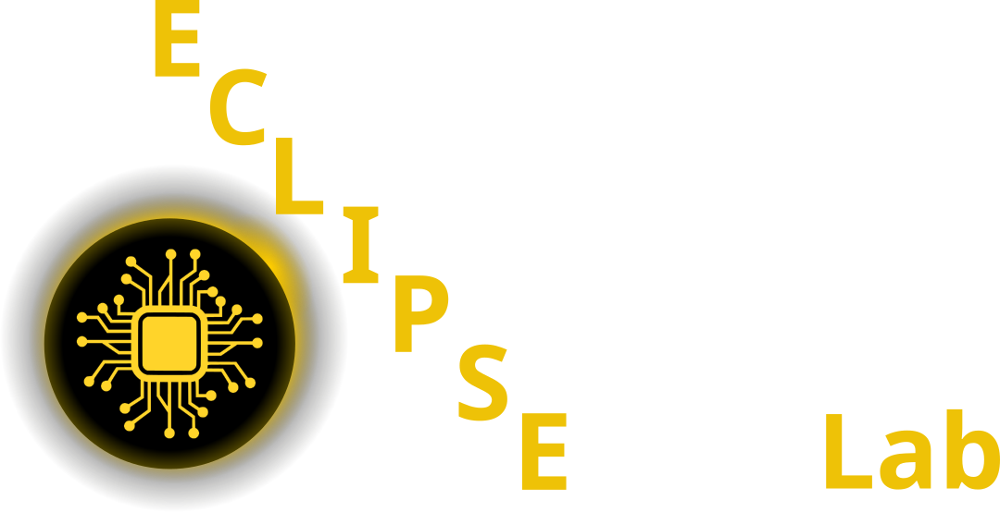

:::: {.columns}

::: {.column width="50%"}

[{width=300}](https://pelzlab.science)

:::

::: {.column width="25%"}
[{width=120}](https://github.com/ECLIPSE-Lab/public_presentations/tree/main/data_science_for_em/notebooks)

**Github Code**
:::

::: {.column width="25%"}
[{width=120}](https://www.studon.fau.de/studon/ilias.php?baseClass=ilrepositorygui&cmd=infoScreenGoto&ref_id=6252031)

**Studon Link**
:::

::::

## Course overview

One 90-minute lecture per week plus one self-study Jupyter notebook per week (runs on a laptop CPU or in Google Colab).
Electron microscopy is the application thread throughout: every method is introduced on EM images, spectra, diffraction data or tilt series.
Lectures are on Fridays; rooms are announced on StudOn.

**Assessment:** miniproject (40%, reproducible notebook + short report) and written exam (60%).

## Week 1: Python crash course & the EM data deluge (23.10.2026) {#sec-week01}

- Slides: [Week 1: Python crash course & the EM data deluge](https://pelzlab.science/public_presentations/data_science_for_em/01_python_crash/01_intro.html)
- Notebook: [`week01_python_numpy.ipynb`](https://colab.research.google.com/github/ECLIPSE-Lab/public_presentations/blob/main/data_science_for_em/notebooks/week01_python_numpy.ipynb) (open in Colab)
- Python & NumPy for EM data; the CRISP-DM workflow; why modern detectors make automated analysis unavoidable; course logistics.

## Week 2: Learning from EM data: signal formation, noise & loss (30.10.2026) {#sec-week02}

- Slides: [Week 2: Learning from EM data: signal formation, noise & loss](https://pelzlab.science/public_presentations/data_science_for_em/02_em_data_formation/01_intro.html)
- Notebook: [`week02_poisson_noise.ipynb`](https://colab.research.google.com/github/ECLIPSE-Lab/public_presentations/blob/main/data_science_for_em/notebooks/week02_poisson_noise.ipynb) (open in Colab)
- Learning vs classical analysis; detectors, dose, sampling and aliasing; Poisson/Gaussian noise; how the noise model determines the loss; data quality and metadata.

## Week 3: Linear algebra, PCA & spectral unmixing (06.11.2026) {#sec-week03}

- Slides: [Week 3: Linear algebra, PCA & spectral unmixing](https://pelzlab.science/public_presentations/data_science_for_em/03_linear_algebra_spectral/01_intro.html)
- Notebook: [`week03_pca_nmf_eels.ipynb`](https://colab.research.google.com/github/ECLIPSE-Lab/public_presentations/blob/main/data_science_for_em/notebooks/week03_pca_nmf_eels.ipynb) (open in Colab)
- SVD and PCA; conditioning; NMF, MCR-ALS and endmember unmixing; the EELS/EDS preprocessing pipeline.

## Week 4: Regression, optimisation & honest validation (13.11.2026) {#sec-week04}

- Slides: [Week 4: Regression, optimisation & honest validation](https://pelzlab.science/public_presentations/data_science_for_em/04_regression_validation/01_intro.html)
- Notebook: [`week04_leakage_demo.ipynb`](https://colab.research.google.com/github/ECLIPSE-Lab/public_presentations/blob/main/data_science_for_em/notebooks/week04_leakage_demo.ipynb) (open in Colab)
- Loss minimisation, gradient descent and optimisers; bias–variance and regularisation; splits by specimen, leakage taxonomy and metrics.

## Week 5: From images to features: descriptors & tree ensembles (20.11.2026) {#sec-week05}

- Slides: [Week 5: From images to features: descriptors & tree ensembles](https://pelzlab.science/public_presentations/data_science_for_em/05_features_trees/01_intro.html)
- Notebook: [`week05_features_trees.ipynb`](https://colab.research.google.com/github/ECLIPSE-Lab/public_presentations/blob/main/data_science_for_em/notebooks/week05_features_trees.ipynb) (open in Colab)
- Particle and grain descriptors; atom-column finding and local-environment descriptors; random forests and gradient boosting; permutation importance and SHAP.

## Week 6: Neural networks & backpropagation (27.11.2026) {#sec-week06}

- Slides: [Week 6: Neural networks & backpropagation](https://pelzlab.science/public_presentations/data_science_for_em/06_neural_networks/01_intro.html)
- Notebook: [`week06_tiny_mlp.ipynb`](https://colab.research.google.com/github/ECLIPSE-Lab/public_presentations/blob/main/data_science_for_em/notebooks/week06_tiny_mlp.ipynb) (open in Colab)
- MLPs, softmax and cross-entropy; autograd and backpropagation; initialisation, normalisation and training diagnostics.

## Week 7: CNNs & U-Nets for microscopy (04.12.2026) {#sec-week07}

- Slides: [Week 7: CNNs & U-Nets for microscopy](https://pelzlab.science/public_presentations/data_science_for_em/07_cnns_for_microscopy/01_intro.html)
- Notebook: [`week07_cnn_segmentation.ipynb`](https://colab.research.google.com/github/ECLIPSE-Lab/public_presentations/blob/main/data_science_for_em/notebooks/week07_cnn_segmentation.ipynb) (open in Colab)
- Convolution and receptive fields; VGG to ResNet; U-Net segmentation; invariance vs equivariance; saliency, Grad-CAM and shortcut learning.

## Week 8: Small data: augmentation, transfer & self-supervision (11.12.2026) {#sec-week08}

- Slides: [Week 8: Small data: augmentation, transfer & self-supervision](https://pelzlab.science/public_presentations/data_science_for_em/08_small_data_self_supervised/01_intro.html)
- Notebook: [`week08_embeddings_transfer.ipynb`](https://colab.research.google.com/github/ECLIPSE-Lab/public_presentations/blob/main/data_science_for_em/notebooks/week08_embeddings_transfer.ipynb) (open in Colab)
- Physics-respecting augmentation; transfer learning and sim-to-real; SimCLR, MAE, DINO; foundation models (SAM, µSAM); linear probes.

## Week 9: Unsupervised learning, autoencoders & latent spaces (18.12.2026) {#sec-week09}

- Slides: [Week 9: Unsupervised learning, autoencoders & latent spaces](https://pelzlab.science/public_presentations/data_science_for_em/09_unsupervised_latent/01_intro.html)
- Notebook: [`week09_autoencoder_vae.ipynb`](https://colab.research.google.com/github/ECLIPSE-Lab/public_presentations/blob/main/data_science_for_em/notebooks/week09_autoencoder_vae.ipynb) (open in Colab)
- k-means and GMMs; autoencoders and VAEs; rVAE for atomic-resolution images; t-SNE/UMAP and how latent spaces mislead.

## Week 10: Attention, transformers & graph networks for EM (08.01.2027) {#sec-week10}

- Slides: [Week 10: Attention, transformers & graph networks for EM](https://pelzlab.science/public_presentations/data_science_for_em/10_transformers_graphs/01_intro.html)
- Notebook: [`week10_attention_gnn.ipynb`](https://colab.research.google.com/github/ECLIPSE-Lab/public_presentations/blob/main/data_science_for_em/notebooks/week10_attention_gnn.ipynb) (open in Colab)
- Self-attention and vision transformers; tokenising diffraction patterns and spectra; atom-column graphs and message passing.

## Week 11: Uncertainty, Gaussian processes & autonomous EM (15.01.2027) {#sec-week11}

- Slides: [Week 11: Uncertainty, Gaussian processes & autonomous EM](https://pelzlab.science/public_presentations/data_science_for_em/11_uncertainty_autonomous_em/01_intro.html)
- Notebook: [`week11_gp_bo.ipynb`](https://colab.research.google.com/github/ECLIPSE-Lab/public_presentations/blob/main/data_science_for_em/notebooks/week11_gp_bo.ipynb) (open in Colab)
- Aleatoric vs epistemic uncertainty; ensembles, calibration and conformal prediction; Gaussian processes, Bayesian optimisation and automated 4D-STEM.

## Week 12: Inverse problems I: regularisation, tomography & sensor fusion (22.01.2027) {#sec-week12}

- Slides: [Week 12: Inverse problems I: regularisation, tomography & sensor fusion](https://pelzlab.science/public_presentations/data_science_for_em/12_inverse_problems_1/01_intro.html)
- Notebook: [`week12_inverse_deblurring.ipynb`](https://colab.research.google.com/github/ECLIPSE-Lab/public_presentations/blob/main/data_science_for_em/notebooks/week12_inverse_deblurring.ipynb) (open in Colab)
- Forward models and ill-posedness; Tikhonov, TV and plug-and-play; tomography and the Fourier-slice theorem; HAADF + EDS sensor fusion.

## Week 13: Inverse problems II: ptychography, generative priors & synthesis (29.01.2027) {#sec-week13}

- Slides: [Week 13: Inverse problems II: ptychography, generative priors & synthesis](https://pelzlab.science/public_presentations/data_science_for_em/13_inverse_problems_2_generative/01_intro.html)
- Notebook: [`week13_ptychography.ipynb`](https://colab.research.google.com/github/ECLIPSE-Lab/public_presentations/blob/main/data_science_for_em/notebooks/week13_ptychography.ipynb) (open in Colab)
- Ptychography and multislice; gradient-descent reconstruction; GAN and diffusion priors; physics constraints; course synthesis and exam preparation.

## Buffer (05.02.2027) {#sec-buffer}

- Catch-up and miniproject Q&A

## Exam revision (12.02.2027) {#sec-revision}

- Repetition and preparation for the exam, based on the must-know list

## Miniproject {#sec-miniproject}

Apply the full pipeline from the course (data → model → uncertainty → explainability) to an electron-microscopy or materials-characterisation dataset, as a fully reproducible notebook plus a 4–6 page report.
Choose one of five options:

A. STEM/SEM image segmentation (U-Net or foundation-model features)
B. Spectral denoising and phase clustering (PCA / NMF / VAE)
C. Materials property regression with honest validation and uncertainty
D. A small imaging inverse problem (deblurring or limited-angle tomography)
E. Atom-column descriptors and defect classification (tree ensembles, optionally a GNN)

Milestones: topic selection from Week 1, proposal around Week 6, progress check-in around Week 10, final submission in the exam period.
The full task descriptions and grading rubric are on StudOn.

## Archive: SS 25 lectures {.unnumbered}

The previous (9-lecture) version of the course is kept here for reference.

### Lecture 1: Intro (13.05.2025)

- Lecture slides: [Lecture 1: Introduction](https://pelzlab.science/public_presentations/data_science_for_em/01_intro/template.html)
- [d2l Chapter 2: Preliminaries](https://d2l.ai/chapter_preliminaries/index.html)

### Lecture 2: Optimization, Regression, Sensor Fusion (20.05.2025)

- Lecture slides: [Lecture 2: Optimization, Regression, Sensor Fusion](https://pelzlab.science/public_presentations/data_science_for_em/02_regression/template.html#/title-slide)
- [d2l Chapter 3: Regression](https://d2l.ai/chapter_linear-regression/index.html)
- [d2l Chapter 12: Optimization](https://d2l.ai/chapter_optimization/index.html)

### Lecture 3: CNNs (03.06.2025)
- Lecture slides: [Lecture 3: CNNs](https://pelzlab.science/public_presentations/data_science_for_em/03_cnns/template.html#/title-slide)
- [d2l Chapter 7: CNNs](https://d2l.ai/chapter_convolutional-neural-networks/index.html)
- [d2l Chapter 8: CNNs](https://d2l.ai/chapter_convolutional-modern/index.html)

### Lecture 4: Classification, Segmentation, AutoEncoders (10.06.2025)

- Lecture slides: [Lecture 4: Classification, Segmentation, AutoEncoders](https://pelzlab.science/public_presentations/data_science_for_em/04_selfsupervised/template.html#/title-slide)
- [d2l Chapter 4: Classification](https://d2l.ai/chapter_linear-classification/index.html)
- [d2l Chapter 14.9: Segmentation](https://d2l.ai/chapter_computer-vision/semantic-segmentation-and-dataset.html)
- Segmentation
- Dimensionality Reduction
  - PCA
  - Autoencoder
  - Variational Autoencoder

### Miniproject (10.6. - 24.6.2025) concurrent to lectures

In the miniproject, you will test multiple deep neural network architectures on one of four microscopy-related tasks.
You should summarize your results in a short presentation (5 minutes + 2 minutes discussion) and deliver a Jupyter Notebook with your code and results.
The miniproject will be graded and will count as 40% towards your final grade.

1. Segmentation Task

    We will use the HRTEM dataset from "A robust synthetic data generation framework for machine learning in high-resolution transmission electron microscopy (HRTEM)" by @rangel2024robust to implement a segmentation model.
    The goal is to segment nanoparticles in HRTEM images.

    Please use the article  "A robust synthetic data generation framework for machine learning in high-resolution transmission electron microscopy (HRTEM)" by @rangel2024robust as a starting point for your implementation.

    The datast contains pairs of HRTEM images and ground truth segmentations. 

2. VAE & Dimensionality Reduction

    We will use the dataset from "Uncovering material deformations via machine learning combined with four-dimensional scanning transmission electron microscopy" by @shi2022uncovering to implement a dimensionality reduction model and cluster 4DSTEM data.

    The goal is to learn a mapping from 4DSTEM data to a lower-dimensional embedding where you can perform clustering to identify different deformation modes.

    Please use the article  "Uncovering material deformations via machine learning combined with four-dimensional scanning transmission electron microscopy" by @shi2022uncovering as a starting point for your implementation.    

3. Denoising

    We will use the dataset from "Unsupervised deep denoising for four-dimensional scanning transmission electron microscopy" by @sadri2024unsupervised to implement a denoising model for 4DSTEM data. 
    
    The goal is to learn a mapping from noisy to clean 4DSTEM data.

    Please use the article  "Unsupervised deep denoising for four-dimensional scanning transmission electron microscopy" by @sadri2024unsupervised as a starting point for your implementation.

    The article contains pytorch code for the model. 
    
    Learn how to adapt it to your needs and try to replicate the results on the SrTiO3_High_mag_Low_dose.npy and SrTiO3_High_mag_High_dose.npy datasets.

4. Image-to-Image Translation

    We will use a simulated X-ray image dataset with pairs of projected thickness and phase contrast images to implement an Image to image translation model. 
    
    The goal is to learn a mapping from phase contrast images to projected thickness images. 
    
    This is usually a task that is solved with multiple measurements and a physical model of the imaging process. 
    
    Here we will try to learn this mapping from simulated data. 
    Please use the article "Multi-resolution convolutional neural networks for inverse problems" by @wang2020multi as a starting point for your implementation.

### Lecture 5: Mixed Bag (24.06.2025)
- Lecture slides: [Lecture 5: Advanced AutoEncoder, GANs, and more](https://pelzlab.science/public_presentations/data_science_for_em/05_gan/template.html#/title-slide)
- Project presentations 
- Generative Adversarial Networks [d2l Chapter 20: Generative Adversarial Networks](https://d2l.ai/chapter_generative-adversarial-networks/index.html)
 

### Lecture 6: Gaussian Processes Introduction (01.07.2025)
- Lecture slides: [Lecture 6: Gaussian Processes Introduction](https://pelzlab.science/public_presentations/data_science_for_em/06_gaussian_processes/template.html)
- Introduction to Gaussian Processes  
- [d2l Chapter 18: Gaussian Processes](https://d2l.ai/chapter_gaussian-processes/index.html)

### Lecture 7: Gaussian Processes Applications (08.07.2025)
- Lecture slides: [Lecture 7: Gaussian Processes Applications](https://pelzlab.science/public_presentations/data_science_for_em/07_gaussian_processes2/template.html)
- Bayesian Optimization
- Active Learning
- Deep Kernel Learning

### Lecture 8: Imaging Inverse Problems 1 (15.07.2025)
- Lecture slides: [Lecture 8: Imaging Inverse Problems 1](https://pelzlab.science/public_presentations/data_science_for_em/08_imaging_inverse_problems1/template.html)
- Imaging Inverse Problems: Introduction

### Lecture 9: Imaging Inverse Problems 2 (22.07.2025)
- Lecture slides: [Lecture 9: Imaging Inverse Problems 2](https://pelzlab.science/public_presentations/data_science_for_em/09_imaging_inverse_problems2/template.html)

## References {.unnumbered}

::: {#refs}
:::